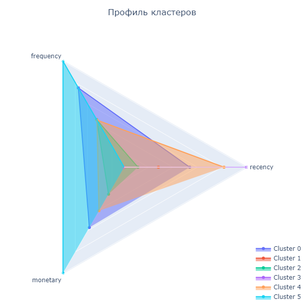

# 
 Сегментация клиентов онлайн магазина подарков

## Содержание
- [Описание проекта](#описание-проекта)
    - [Описание данных](#описание-данных)
- [Основные шаги](#основные-шаги)
- [Финальные выводы](#финальные-выводы)

## Описание проекта

Набор данных содержит все транзакции, произошедшие в период с 01/12/2010 по 09/12/2011 для базирующейся в Великобритании компании, занимающейся онлайн-розничной торговлей. Компания в основном продает уникальные подарки на все случаи жизни. Многие клиенты компании являются оптовиками.

**Бизнес-задача:** произвести сегментацию существующих клиентов, проинтерпретировать эти сегменты и определить стратегию взаимодействия с ними.

**Техническая задача:** построить модель кластеризации клиентов на основе их покупательской способности, частоты заказов и срока давности последней покупки, определить профиль каждого из кластеров.

**Основные цели проекта:**
1. Проведение предобработки исходного набора данных о транзакциях;
2. Проведение разведывательного анализа данных и выявление основных закономерностей;
3. Формирование набора данных о характеристиках каждого из уникальных клиентов;
4. Построение нескольких моделей машинного обучения, решающих задачу кластеризации клиентов, определение количества кластеров и их интерпретация.

Данные представляют собой таблицу в формате CSV, в каждой строке которой содержится информация об уникальной транзакции.

Признаки, описывающие каждую транзакцию:

* InvoiceNo — номер счёта-фактуры (уникальный номинальный шестизначный номер, присваиваемый каждой транзакции; буква "C" в начале кода указывает на отмену транзакции);
* StockCode — код товара (уникальное пятизначное целое число, присваиваемое каждому отдельному товару);
* Description — название товара;
* Quantity — количество каждого товара за транзакцию;
* InvoiceDate — дата и время выставления счёта/проведения транзакции;
* UnitPrice — цена за единицу товара в фунтах стерлингов;
* CustomerID — идентификатор клиента (уникальный пятизначный номер, однозначно присваиваемый каждому клиенту);
* Country — название страны, в которой проживает клиент.

Информация о данных:
- В заказе может быть указано отрицательное количество товара (Quantity < 0). Как правило, это свидетельствует о возврате товара, но также может означать скидки.
- В системе учёта транзакций на каждый уникальный товар в заказе заводится отдельная транзакция.
- На возврат каждого уникального товара также заводится отдельная транзакция (уникальная запись в таблице).
- Номер заказа (InvoiceNo) может содержать не только числа, но и символы: например, символ 'C' перед номером заказа указывает на признак возврата. То есть в таблице должна находиться запись с такими же идентификаторами клиента и товара, но номером заказа без символа 'C' и с положительным количеством товара.
- Код товара (StockCode) также может содержать не только числа, но и символы: например, 'D' означает, что товар является скидочным и на такие товары нет аналогов с положительным числом товаров в заказе.
- Не все заказы с отрицательным количеством товара имеют в таблице свои аналоги (контрагентов). 

### Описание данных

Данные представляют собой таблицу в формате CSV, в каждой строке которой содержится информация об уникальной транзакции.

Признаки, описывающие каждую транзакцию:

* InvoiceNo — номер счёта-фактуры (уникальный номинальный шестизначный номер, присваиваемый каждой транзакции; буква "C" в начале кода указывает на отмену транзакции);
* StockCode — код товара (уникальное пятизначное целое число, присваиваемое каждому отдельному товару);
* Description — название товара;
* Quantity — количество каждого товара за транзакцию;
* InvoiceDate — дата и время выставления счёта/проведения транзакции;
* UnitPrice — цена за единицу товара в фунтах стерлингов;
* CustomerID — идентификатор клиента (уникальный пятизначный номер, однозначно присваиваемый каждому клиенту);
* Country — название страны, в которой проживает клиент.

Информация о данных:
- В заказе может быть указано отрицательное количество товара (Quantity < 0). Как правило, это свидетельствует о возврате товара, но также может означать скидки.
- В системе учёта транзакций на каждый уникальный товар в заказе заводится отдельная транзакция.
- На возврат каждого уникального товара также заводится отдельная транзакция (уникальная запись в таблице).
- Номер заказа (InvoiceNo) может содержать не только числа, но и символы: например, символ 'C' перед номером заказа указывает на признак возврата. То есть в таблице должна находиться запись с такими же идентификаторами клиента и товара, но номером заказа без символа 'C' и с положительным количеством товара.
- Код товара (StockCode) также может содержать не только числа, но и символы: например, 'D' означает, что товар является скидочным и на такие товары нет аналогов с положительным числом товаров в заказе.
- Не все заказы с отрицательным количеством товара имеют в таблице свои аналоги (контрагентов). 

## Основные шаги

- Загрузка и предобработка данных
    - Обработка пропусков
    - Удаление дубликатов
- Развездывательный анализ
    - Построение RFM-таблицы и поиск RFM-выбросов
    - Выводы
- Моделирование и оценка качества моделей
    - Кластеризация на основе RFM-характеристик
    - Интерпретация результатов кластеризации

## Финальные выводы

В ходе работы:
1. Проведена предобработка исходного набора данных о транзакциях;
2. Проведён разведывательный анализ данных, в результате которого были сделаны следующие выводы:
    - Практически все клиенты делают заказы из Великобритании
    - Больше всех покупают товаров и приносят прибыль клиенты из Ирландии, Нидерландов и Австралии
    - Наибольший общий доход приносят клиенты из Великобритании, Нидерландов и Ирландии
    - Количество заказов зависит от даты и времени 
    - Существует суточная и недельная сезонность и тренд
    - Данных за субботу нет
    - Наибольшее количество заказов поступает в четверг, наименьшее - в пятницу
    - Основная масса заказов поступает в районе 12 часов
    - Распределение среднего количества ежедневно поступающих заказов по часу совершения транзакции нормальное
3. Сформирован набор данных о характеристиках (RFM) каждого из уникальных клиентов ;
4. Определено оптимальное количество кластеров - 6 и построено несколько моделей машинного обучения (KMeans, GaussianMixture, AgglomerativeClustering и Birch). Среди всех моделей выбрана GaussianMixture.

В итоге выделено 6 групп клиентов:
- Группа 0: клиенты, которые покупают часто, тратят много денег и давно совершили покупку
- Группа 1: клиенты, которые покупают редко, тратят мало денег, и очень давно совершили покупку
- Группа 2: клиенты, которые покупают нечасто, тратят немного денег, и очень давно совершили покупку
- Группа 3: клиенты, которые покупают редко, тратят мало денег, и совсем недавно совершили покупку
- Группа 4: клиенты, которые покупают нечасто, тратят немного денег, и недавно совершили покупку
- Группа 5: клиенты, которые покупают очень часто, тратят очень много денег и очень давно совершили покупку

